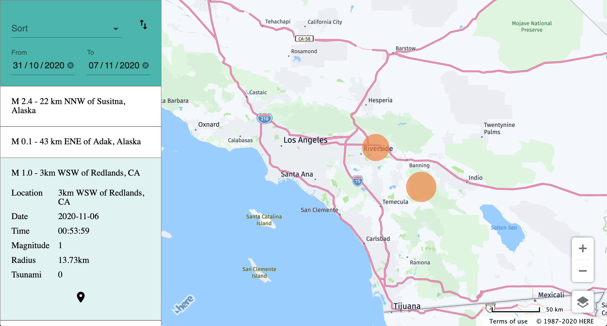

# Earthquake React App

[](https://www.repostatus.org/#abandoned)

Earthquake React App is a web application that provides a sortable and searchable list of earthquakes. The earthquakes are also visualized on an interactive map.

_The project was made during "Hackday" at [\</salt>](https://salt.study/)._

## Installation and setup

### Install

Use npm to install dependencies by running the following command in the server and client directories.

```bash
npm i
```

### API KEY

[Get your HERE API key](https://developer.here.com/documentation/authentication/dev_guide/topics/api-key-credentials.html)

Add a .env file in the client folder. Add the following line inside the file with your HERE API key at the end.

```bash
REACT_APP_HERE_MAPS_API_KEY=
```

### Start Application

To start the development servers you will need to run the following command in the server and client directories.

```bash
npm start
```

The React app will now be accessible at http://localhost:3000/

## Visuals



## Project Status

This was meant to be a "one" day project and will not be updated anymore.
